# Bonus — Containerization, global exception handling, and security

Covers all three bonus items from the exercise, since the roadmap lists them as a single line.

## A. Containerize the app

### Project layout

```
src/PartnerIntegrationBFF.Api/
└── Dockerfile              # Multi-stage: SDK build → ASP.NET runtime
.dockerignore
docker-compose.yml          # rabbitmq + api services
```

### Running everything in Docker

```bash
docker compose up -d --build
```

This builds the API image and starts both containers: `rabbitmq` (Step 3) and `api` (this bonus
item), with `api` waiting for `rabbitmq`'s healthcheck before starting
(`depends_on: rabbitmq: condition: service_healthy`). The API is reachable at
`http://localhost:8080` on the host.

Inside the `api` container, `RabbitMq__HostName=rabbitmq` (set via `docker-compose.yml`) overrides
`appsettings.json`'s `localhost` default — `rabbitmq` resolves through Compose's internal DNS to
the other container; `localhost` would resolve to the `api` container itself, which has no broker
running in it.

### Design choices

- **Multi-stage Dockerfile**: a `build` stage with the full SDK (needed to compile), and a
  `runtime` stage with just the ASP.NET runtime image — the final image doesn't carry the SDK,
  compiler, or source code, only the published output.
- **`.csproj` layer copied before the rest of the source** so `dotnet restore` is cached as its
  own Docker layer, and only re-runs when a `.csproj` actually changes — editing a `.cs` file
  doesn't force a full package restore on every rebuild.
- **`.dockerignore` excludes `appsettings.Local.json`** (and `docs/`, `postman/`, `*.md`, `bin/`,
  `obj/`) from the build context — real broker credentials should never even be visible to the
  Docker build, let alone end up in an image layer. See the incident below.

### ⚠️ Testing limitation — and how it's verified anyway

Neither side of this conversation has a working Docker install available while building this
(see [step-3-async-messaging.md](step-3-async-messaging.md) for why — BIOS-level virtualization
disabled by a corporate IT policy). This was verified in three layers, from static review up to
actually running it:

1. **Static review** — `Dockerfile` and `docker-compose.yml` read carefully, YAML validated for
   syntax errors, environment variable syntax (`RabbitMq__HostName`) checked against ASP.NET
   Core's configuration-binding rules.
2. **Local simulation, no container** — `dotnet publish -c Release` (the exact command the build
   stage runs) executed locally and the published output run directly, confirming the app itself
   builds and handles a real transaction in Release mode. This doesn't prove anything about the
   container/network side.
3. **The real thing, on CI** — [`.github/workflows/docker-compose-smoke-test.yml`](../../.github/workflows/docker-compose-smoke-test.yml)
   runs on GitHub's own runners (which have Docker preinstalled) on every push/PR touching the
   Dockerfile, the compose file, the API source, or the Postman collection:
   1. `docker compose up -d --build` — the exact multi-stage build, for real.
   2. Polls `docker inspect` until the `rabbitmq` container's healthcheck reports `healthy`.
   3. Polls the `api` container until it accepts connections on port `8080`.
   4. Runs the **"Docker Compose smoke test" folder** of the Postman collection via
      [Newman](https://github.com/postmanlabs/newman) (Postman's official CLI runner) against the
      live containers — see below for why this is separate from requests 1-14.
   5. Dumps `docker compose logs` on failure, and always tears the stack down afterwards.

Layer 3 is the only one that actually answers "does `docker-compose.yml` really spin up both the
API and the queue, and do they actually reach each other?" — that specific combination (image
build succeeding in a real Docker daemon, two containers reaching a healthy state, and them
resolving each other over the Compose network) can't be simulated without Docker itself.

**Proof it actually ran, green, on real Docker:**

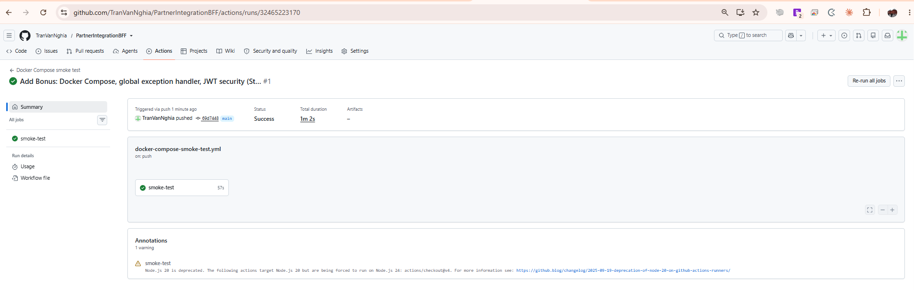

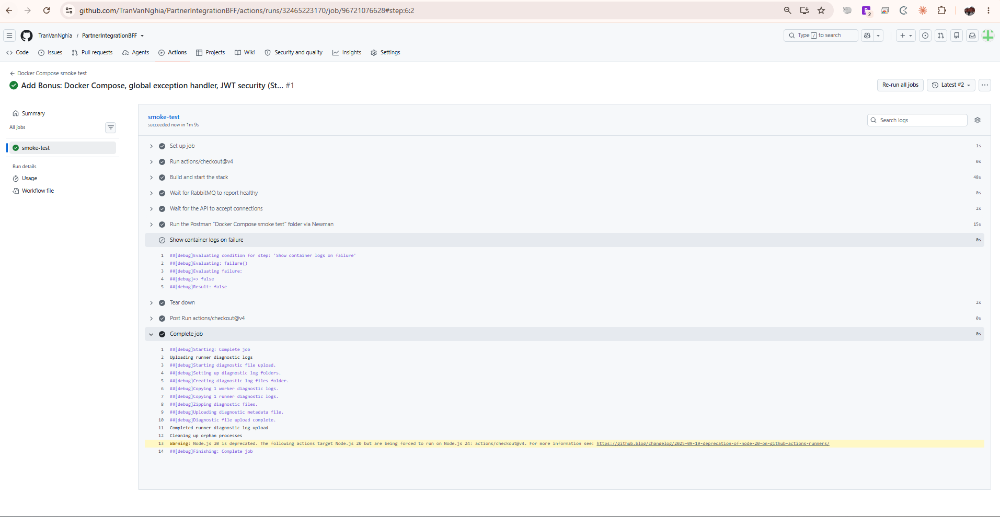

The second screenshot is the step-by-step job log: `Build and start the stack` (the actual
`docker compose up -d --build`), `Wait for RabbitMQ to report healthy`, `Wait for the API to accept
connections`, then the Newman run against the Postman folder — each step green, each with its own
timing. The one warning annotation (Node.js 20 deprecation on `actions/checkout@v4`) is a
GitHub-runner notice unrelated to this project and requires no action.

#### Why a separate Postman folder instead of reusing requests 1-14

Requests 1-14 target `{{baseUrl}}` (`https://localhost:7051` by default — the `dotnet run` dev
workflow) and several of them (`#10`-`#14`) assume `Security:RequireAuthentication: true`, which
isn't set in the Docker image (it defaults to `false`). Reusing them against the container would
either require overriding config just for CI or silently exercise different behaviour than what
the request names describe. Instead, a dedicated **"Docker Compose smoke test" folder** (3
requests, targeting a separate `{{dockerBaseUrl}}` = `http://localhost:8080` variable) keeps the
two concerns cleanly apart:

- **#15 Valid transaction → `202`** (or rarely `503` — the same ~2.7% retry-exhaustion case as
  Step 2) — confirms the `api` container can actually reach the `rabbitmq` container and queue a
  message, i.e. the whole point of this bonus item.
- **#16 Empty payload → `400`** — confirms the published image isn't running stale/missing code.
- **#17 Partner verification simulator reachable → `200`/`500`** — used as the CI workflow's own
  readiness probe before it runs #15.

Run manually with `docker compose up -d --build` and Postman pointed at `{{dockerBaseUrl}}`, or
let CI run them automatically via `npx newman run postman/PartnerIntegrationBFF.postman_collection.json --folder "Docker Compose smoke test (targets {{dockerBaseUrl}})" --env-var dockerBaseUrl=http://localhost:8080`.

### Incident found while building this: a real secret nearly leaked into the image

While testing the `dotnet publish` step locally, `appsettings.Local.json` — which holds this
project's real CloudAMQP password — turned up in the publish output directory. The ASP.NET Core
Web SDK globs `**/*.json` into the project by default, so any `appsettings.*.json` file sitting in
the project folder gets copied to the build/publish output, `.gitignore` or not — `.gitignore`
only stops git from committing a file, it has no effect on MSBuild's own copy-to-output behavior.
Had this gone unnoticed, a Docker image built from this Dockerfile would have baked the real
secret into an image layer, and pushing that image anywhere (even a "private" registry) would
have leaked it.

Fixed in `PartnerIntegrationBFF.Api.csproj`:

```xml
<Content Remove="appsettings.Local.json" />
<None Include="appsettings.Local.json" CopyToOutputDirectory="Never" CopyToPublishDirectory="Never" Condition="Exists('appsettings.Local.json')" />
```

Verified by re-running `dotnet publish` and confirming `appsettings.Local.json` no longer appears
in the output, while `dotnet run` (the normal dev workflow) still picks it up correctly — the fix
only affects what gets *copied to a build/publish output*, not what `Program.cs` reads from the
source tree at dev-time.

## B. Global Exception Handler

### Project layout

```
src/PartnerIntegrationBFF.Api/ErrorHandling/
└── GlobalExceptionHandler.cs
```

### What it does

Implements .NET 8's built-in `IExceptionHandler` interface, registered via
`AddExceptionHandler<GlobalExceptionHandler>()` + `AddProblemDetails()` and wired up with
`app.UseExceptionHandler()` as the very first middleware in the pipeline. Any exception that
reaches ASP.NET Core without already having been caught closer to where it happened (the
`PartnerVerificationUnavailableException`/`TransactionQueueUnavailableException` handling already
in `PartnerTransactionsController` runs *before* this ever triggers) gets turned into a
`ProblemDetails` JSON body with a `500` status, instead of a bare, inconsistent error page.

### Before vs. after

Without a global handler, an exception nobody explicitly caught (a genuine bug, not one of the
already-handled cases) surfaces however the environment happens to render an unhandled exception:
the Development exception page (a full stack trace, safe for local debugging but never something
to expose publicly) in `Development`, or an empty/inconsistent `500` in other environments. With
`GlobalExceptionHandler` registered, *every* environment gets the same structured JSON body:

```json
{
  "type": "https://tools.ietf.org/html/rfc9110#section-15.6.1",
  "title": "An unexpected error occurred.",
  "status": 500,
  "instance": "/api/v1/partner/transactions"
}
```

#### What `type` actually is

`type` is not a real endpoint to call — it's a **URI identifying the error kind**, per
[RFC 9457 "Problem Details for HTTP APIs"](https://www.rfc-editor.org/rfc/rfc9457) (the format
behind every `400`/`403`/`422`/`503`/`500` response in this API). ASP.NET Core's default
`ProblemDetails` fills it in as a link to the relevant section of
[RFC 9110](https://www.rfc-editor.org/rfc/rfc9110), the HTTP semantics spec — each status code has
its own section:

| Status | RFC 9110 section |
|---|---|
| `400 Bad Request` | 15.5.1 |
| `401 Unauthorized` | 15.5.2 |
| `403 Forbidden` | 15.5.4 |
| `422 Unprocessable Content` | 15.5.21 |
| `500 Internal Server Error` | 15.6.1 |
| `503 Service Unavailable` | 15.6.4 |

A client never needs to fetch that URL — the numeric `status` field is what matters
programmatically; `type` is just a machine-readable reference back to the spec's own definition of
what that status code means, for anyone who wants to look it up.

### Walking through `TryHandleAsync`

1. `_logger.LogError(exception, ...)` — writes the **real** exception (message, stack trace) to
   `logs/log-*.txt` via Serilog, so it's still fully debuggable even though the client never sees
   it.
2. `httpContext.Response.StatusCode = 500` + `WriteAsJsonAsync(problemDetails, ...)` — writes the
   generic `ProblemDetails` body shown above. **Deliberately generic**: `problemDetails.Title` is a
   fixed string, never `exception.Message` — leaking the real exception message/type to an API
   caller can hand an attacker information about internals (class names, file paths, query
   fragments) that has nothing to do with the request they sent.
3. `return true` — tells ASP.NET Core "fully handled, stop here": no developer exception page, no
   re-throw. Returning `false` would mean the opposite — the framework treats the exception as
   still unhandled and falls back to its default behaviour.

### Design choices

- **`IExceptionHandler`**, not custom middleware wrapping everything in a `try/catch` — this is
  the framework-native way to do this in .NET 8+, integrates with `AddProblemDetails()`'s
  conventions, and composes correctly with the JSON response the rest of the API already returns
  for its own explicit error cases (`400`/`403`/`422`/`503`).
- **Logs the exception** (with the request method/path) before formatting the response, so the
  real stack trace is still available in `logs/log-*.txt` even though the client only sees a
  generic message — never leak internal exception details/stack traces to the API's callers.
- **Only the "didn't see this coming" case** — this handler is a last-resort safety net, not a
  replacement for the specific error handling already in the controller:

  | Error | Who catches it | Response |
  |---|---|---|
  | Invalid payload | `PartnerTransactionsController`'s own validation check | `400` |
  | Token missing/invalid | `RequireAuthenticationMiddleware` | `401` |
  | Token valid, wrong partner | `PartnerTransactionsController` + `PartnerAuthorizationService` | `403` |
  | Partner verification API unreachable | `try/catch (PartnerVerificationUnavailableException)` in the controller | `503` |
  | Partner not verified | `PartnerTransactionsController`'s own check | `422` |
  | Message queue unreachable | `try/catch (TransactionQueueUnavailableException)` in the controller | `503` |
  | **Anything else — a genuine bug** | `GlobalExceptionHandler` | `500` |

## C. Securing the endpoint (JWT, with a config toggle)

### Project layout

```
src/PartnerIntegrationBFF.Api/
├── Security/
│   ├── JwtOptions.cs
│   ├── SecurityOptions.cs               # RequireAuthentication flag + ClientSecret
│   ├── JwtTokenService.cs               # Issues HS256 JWTs
│   ├── PartnerAuthorizationService.cs   # partnerId-claim-matches-body check
│   └── RequireAuthenticationMiddleware.cs
├── Controllers/
│   └── AuthController.cs                # POST /api/v1/auth/token
└── Models/
    ├── TokenRequest.cs
    └── TokenResponse.cs
```

### How it works

1. `POST /api/v1/auth/token` with `{ "partnerId", "clientSecret" }` — if `clientSecret` matches
   `Security:ClientSecret`, returns a JWT with a `partnerId` claim (HS256, 15-minute expiry by
   default).
2. `RequireAuthenticationMiddleware`, registered globally (`app.UseMiddleware<...>()` right after
   `app.UseAuthentication()`), rejects **every** request with `401` unless it carries a valid JWT
   — except three exempt path prefixes: `/api/v1/auth` (the token endpoint itself — nothing could
   ever get a first token otherwise), `/api/internal/partner-verification` (the simulated
   "external" API, called by this app's own `PartnerVerificationClient`, not a partner), and
   `/swagger` (interactive docs, dev-only).
3. On top of that global `401` check, `PartnerTransactionsController` adds one more, specific to
   itself: the authenticated token's `partnerId` claim must match the `partnerId` in the request
   body, via `PartnerAuthorizationService`. Mismatch → `403`. This isn't (and can't be) part of
   the global middleware, since it's tied to a specific field of a specific endpoint's body, not a
   generic "is this caller allowed in at all" check.
4. Everything is gated behind `Security:RequireAuthentication` (default `false` in
   `appsettings.json`), read live via `IOptionsMonitor<SecurityOptions>` — flipping it in
   `appsettings.Local.json` (which reloads at runtime) takes effect without restarting the app.
   With the flag off, the API behaves exactly as it did before this bonus item: no token needed
   anywhere, matching the 63 existing unit tests and Postman requests 1-9.

### Why not just `[Authorize]`?

`[Authorize]` is a compile-time attribute — it always demands authentication, with no way to read
`Security:RequireAuthentication` at request time. Putting `[Authorize]` on
`PartnerTransactionsController` would mean **`RequireAuthentication: false` in config would still
get every request rejected with 401** — the toggle the exercise explicitly asked for
("khi nào bảo mật thì bật thì xác thực không thì bypass") would stop working entirely.

`RequireAuthenticationMiddleware` exists specifically to make the toggle real: it reads the flag
fresh on every request, so switching it in `appsettings.Local.json` changes behaviour immediately,
and — because it's global middleware rather than a per-controller attribute — every *future*
endpoint is protected automatically without anyone having to remember to add `[Authorize]` to it.

The `partnerId`-matches-body check (`PartnerAuthorizationService`) is a separate concern from
"is this caller authenticated at all", and `[Authorize]` couldn't express it either way — it only
evaluates claims/roles/policies, not arbitrary request-body fields, so that check has to live in
the controller (or a resource-based authorization handler, which for a single field on a single
endpoint would be more machinery than the check itself) regardless of how the 401 side is done.

### Testing

Requests 10-14 in
[`postman/PartnerIntegrationBFF.postman_collection.json`](../../postman/PartnerIntegrationBFF.postman_collection.json).
First, enable the flag (it defaults to `false` so requests 1-9 don't need a token):

```bash
cd src/PartnerIntegrationBFF.Api
cp appsettings.Local.json.example appsettings.Local.json   # if you don't already have one
# then set "Security": { "RequireAuthentication": true } in appsettings.Local.json
```

| # | Request | Expected |
|---|---|---|
| 10 | Get token, correct `clientSecret` | `200` + JWT; Postman test script saves it to `{{token}}` |
| 11 | Get token, wrong `clientSecret` | `401` |
| 12 | Transaction with no `Authorization` header | `401` (rejected by the middleware, never reaches the controller) |
| 13 | Transaction with `{{token}}` (issued for `P-1001`) but body says `P-9999` | `403` |
| 14 | Transaction with `{{token}}` and matching body `partnerId` | Continues the normal pipeline (`202`/`422`/`503` depending on verification/queue state, same as request #1) |

Each one run for real in Postman, in request order:

With `Security:RequireAuthentication` set to `true` in `appsettings.json`:

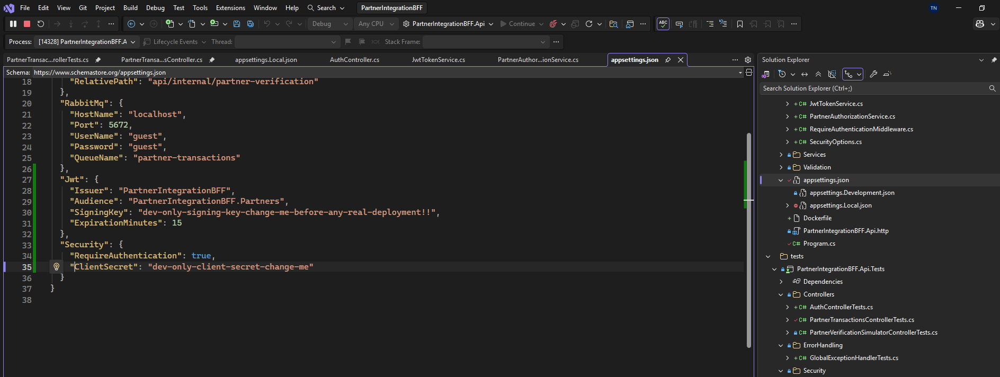

**#10 — get a token with the correct `clientSecret`:**

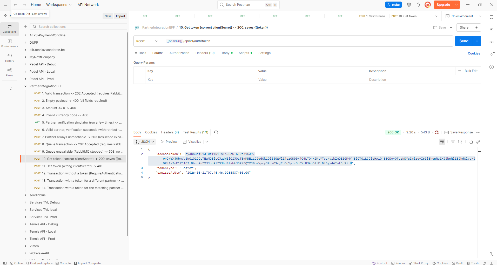

**#11 — get a token with the wrong `clientSecret`:**

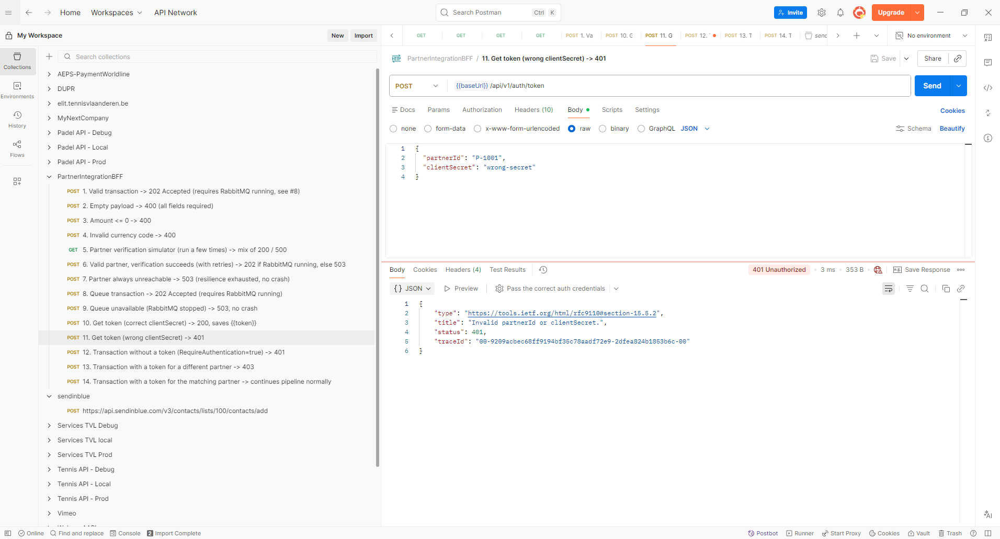

**#12 — transaction with no `Authorization` header at all** (rejected before it ever reaches the
controller):

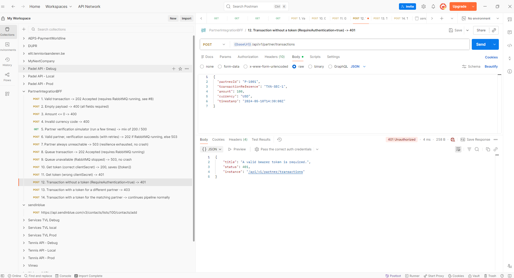

**#13 — valid token, but for a different partner than the request body:**

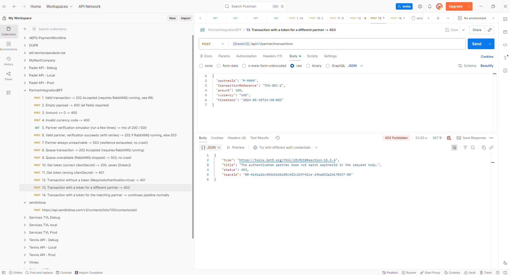

**#14 — valid token, matching partner** — the `Authorization: Bearer {{token}}` header (auto-filled
from request #10's saved variable) and the resulting `202 Accepted`:

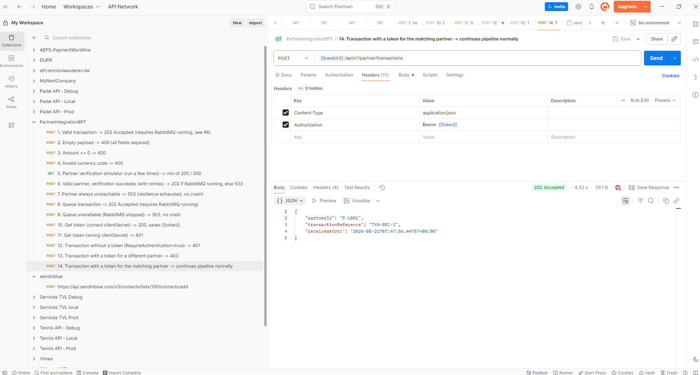

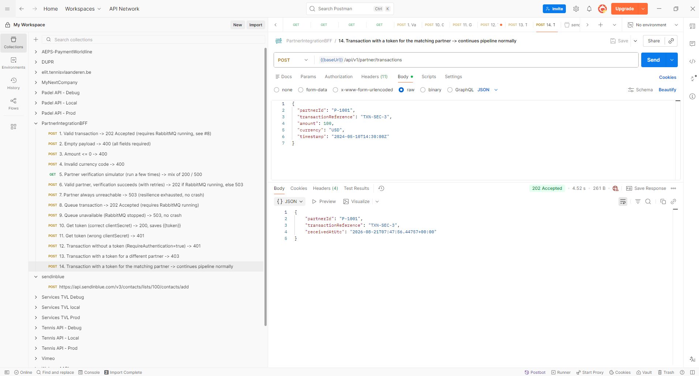

Verified manually end-to-end against a running instance: `401` → get token (`200`) → mismatched
partner (`403`) → matching partner (`202`, message published to the CloudAMQP queue) → confirmed
the internal verification endpoint stays reachable throughout despite the flag being on.

For comparison, with the flag back to its default `false`, the exact same request — still no
`Authorization` header at all — succeeds on its own, confirming the toggle genuinely restores the
pre-Bonus behaviour instead of just relaxing the check:

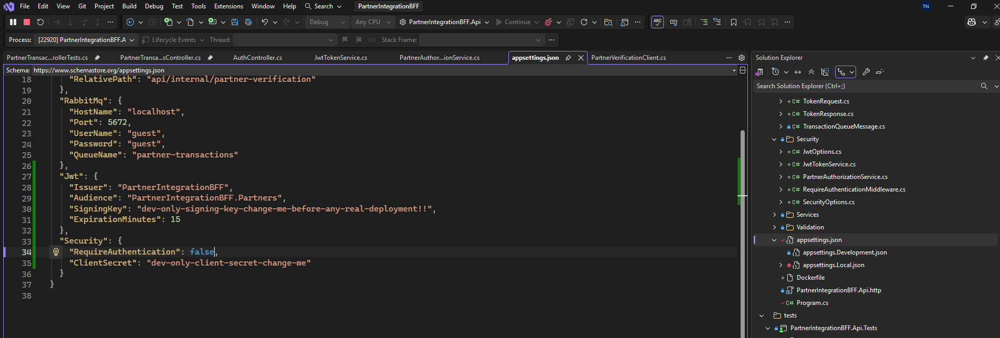

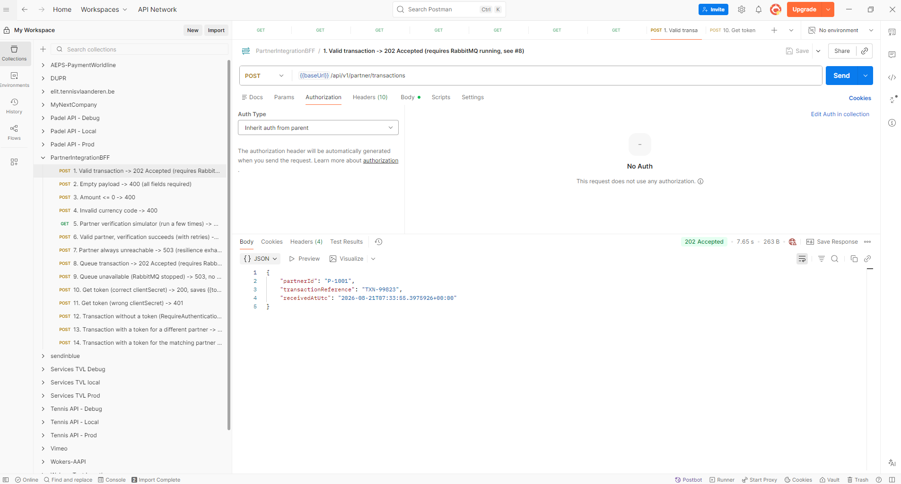

Unit tests: `JwtTokenServiceTests`, `PartnerAuthorizationServiceTests`, `AuthControllerTests`,
`RequireAuthenticationMiddlewareTests`, plus three new cases added to
`PartnerTransactionsControllerTests` covering the 403/202-with-auth/unaffected-when-flag-off paths.
All 63 tests pass:

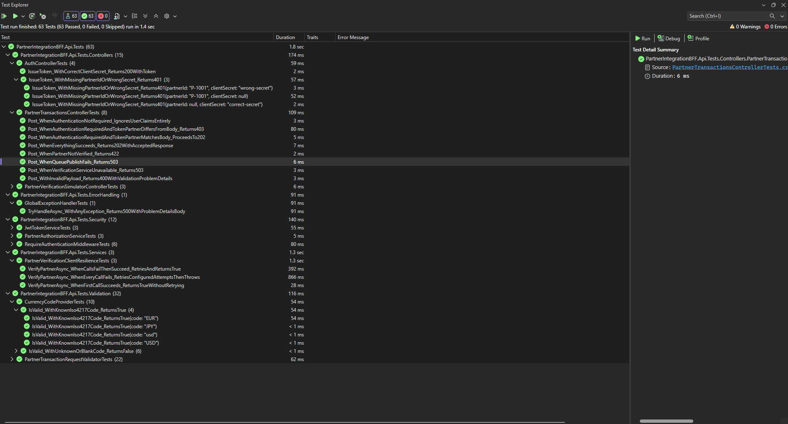

#### The `BuildController` test helper

Adding Security meant `PartnerTransactionsControllerTests` needed to exercise the *same*
controller under several different identities/flag combinations (anonymous with the flag off,
authenticated as the matching partner, authenticated as a different partner) — not just one fixed
setup. `BuildController` is a small factory method that captures the repetitive wiring once:

```csharp
private PartnerTransactionsController BuildController(bool requireAuthentication = false, ClaimsPrincipal? user = null)
{
    return new PartnerTransactionsController(
        _validator.Object,
        _partnerVerificationClient.Object,
        _transactionQueuePublisher.Object,
        _partnerAuthorizationService,
        Options.Create(new SecurityOptions { RequireAuthentication = requireAuthentication, ClientSecret = "test-secret" }),
        new Mock<ILogger<PartnerTransactionsController>>().Object)
    {
        ControllerContext = new ControllerContext
        {
            HttpContext = new DefaultHttpContext
            {
                RequestServices = new ServiceCollection().AddMvc().Services.BuildServiceProvider(),
                User = user ?? new ClaimsPrincipal(new ClaimsIdentity()),
            },
        },
    };
}
```

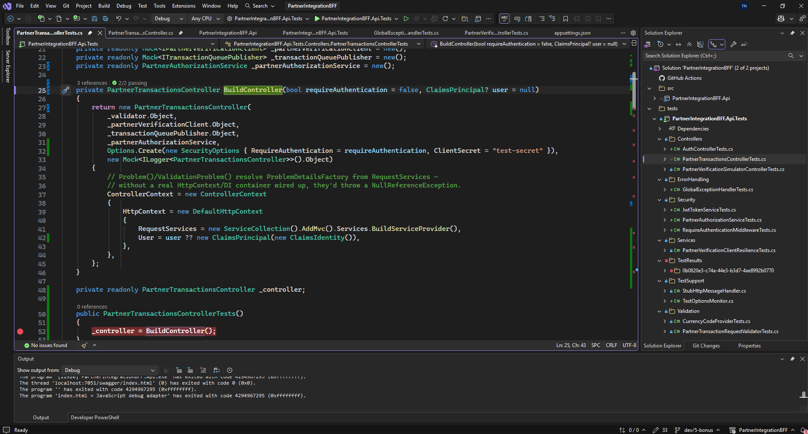

What each parameter/piece is doing:

- **`requireAuthentication` (default `false`)** — becomes the `SecurityOptions.RequireAuthentication`
  wired into `IOptions<SecurityOptions>`. Defaulting to `false` means every *existing* test that
  calls `BuildController()` with no arguments keeps exercising the pre-Bonus behaviour unchanged;
  only the tests that explicitly care about the auth-enabled path pass `true`.
- **`user` (default `null`)** — becomes `HttpContext.User`. `null` maps to
  `new ClaimsPrincipal(new ClaimsIdentity())`, an *unauthenticated* principal with no claims — the
  same shape `HttpContext.User` has for a real request that arrived with no bearer token at all.
  Tests that need an authenticated caller pass `AuthenticatedUser("P-1001")` (a small helper that
  builds a `ClaimsPrincipal` with a `partnerId` claim and `authenticationType: "Bearer"`) instead.
- **The mocked dependencies (`_validator`, `_partnerVerificationClient`, `_transactionQueuePublisher`)
  are shared fields**, not rebuilt per call — each test configures only the behaviour it needs via
  `Setup(...)` before calling `BuildController()`/`Post(...)`, and Moq's default "unconfigured
  method returns default value" behaviour handles the rest.
- **`_partnerAuthorizationService` is the real implementation**, not a mock — it's a small,
  pure, dependency-free class (see its own section above), so there's nothing to gain from mocking
  it and doing so would mean the test no longer verifies the actual matching logic.
- **`RequestServices = new ServiceCollection().AddMvc().Services.BuildServiceProvider()`** exists
  purely so `Problem()`/`ValidationProblem()` (called inside `Post()`) can resolve
  `ProblemDetailsFactory` from DI — without *some* `RequestServices`, `HttpContext.RequestServices`
  is `null` and those calls throw a `NullReferenceException` that has nothing to do with whatever
  the test is actually trying to verify.
- **Two ways to get a controller instance**: the shared `_controller` field (built once per test via
  the constructor calling parameterless `BuildController()`) for the five original tests that don't
  care about auth, and a fresh `var controller = BuildController(requireAuthentication: true, user: ...)`
  local variable in each auth-specific test — using a fresh instance (rather than mutating the
  shared one) avoids one test's auth setup leaking into another test that runs after it.

### Simplifications, and what production would use instead

This is a working demonstration of the *concept* of securing the endpoint, deliberately scoped
down for the exercise:

| Here | Production would use |
|---|---|
| One shared `Security:ClientSecret` for every partner | A real per-partner credential store, so one partner's leaked secret doesn't compromise everyone |
| HS256 (symmetric key — the same secret signs and verifies) | RS256/ES256 (asymmetric) with a JWKS endpoint, so verifying a token never requires possessing the signing key |
| Signing key sitting in `appsettings.json` (a placeholder dev value) | A secret manager (Azure Key Vault, AWS Secrets Manager, etc.), injected via environment variables, never committed |
| No key rotation | Scheduled key rotation with overlapping validity windows |
| `Security:RequireAuthentication` toggleable via config | Not toggleable at all — a real deployment doesn't ship a switch to turn its own security off |
| This app issuing its own tokens | A real OAuth2 Identity Provider (Auth0, Azure AD B2C, etc.) issuing tokens via the client-credentials grant |
